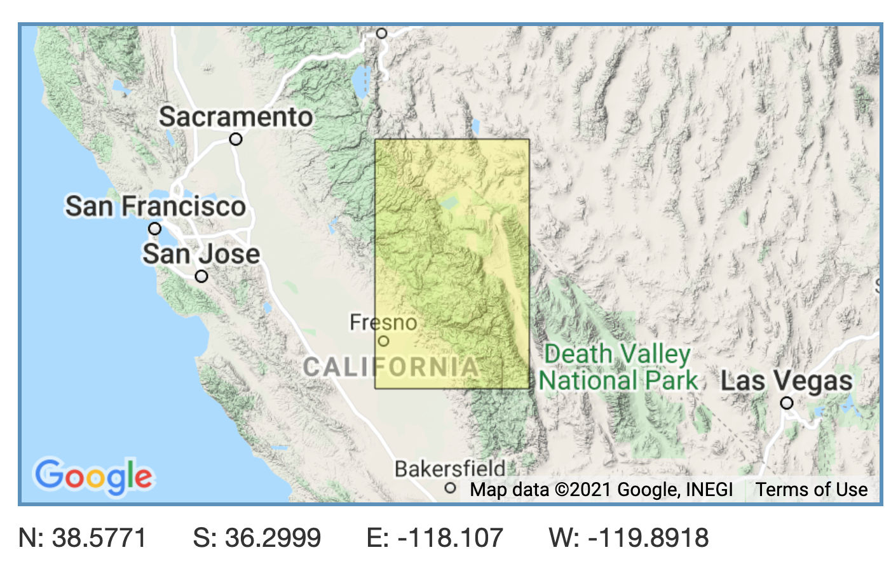

### Overview

This report provides an exploratory overview of mountain yellow-legged frog (Rana muscosa) abundance recorded by the Sierra Lakes Inventory Project (SLIP) from 1995-2002. The original objective of SLIP was to describe impacts of non-native fish on lake communities, but SLIP data has subsequently enabled study of additional ecological issues, including regional amphibian declines and their impacts on communities, and impacts of non-native fish on terrestrial species. In addition, these data are being used to develop fish removal efforts to restore aquatic ecosystems and recover endangered amphibians.

{width=50%, align=center}

### Data

This data describes the physical characteristics of and surveyed aquatic communities for > 8,000 lentic water bodies in the southern Sierra Nevada, including lakes, ponds, marshes, and meadows. The SLIP data is stored in a relational database that collectively describes water bodies (e.g., depth, elevation, location), surveys (conditions, effort), and communities (including approximately 170 fish, amphibian, reptile, benthic macroinvertebrate, and zooplankton taxa).


```{r, warning=FALSE, message=FALSE}
knitr::opts_chunk$set(echo = TRUE)

library(tidyverse)
library(janitor)
library(here)

library(patchwork) #building compound figures
library(readxl) #read in excel documents
library(lubridate) #convert dates to R readable

```

```{r, warning=FALSE, message=FALSE}

#Wrangle data to extract mountain yellow-legged frog (Rana muscosa) count each year across all water bodies
sierra_amphibians <- read_excel(here("_posts", "post_data", "sierra_amphibians.xlsx")) %>% #read in amphibian excel file
  filter(amphibian_species == "RAMU") %>% #filter by RAMU
  mutate(survey_date = ymd(survey_date)) %>% #convert survey date column to an R readable date formate
  mutate(record_year = year(survey_date)) %>% #extract only year value and put in new coluumn record_year
  filter(amphibian_life_stage != "EggMass") %>% #filter our EggMass values
  group_by(record_year, amphibian_life_stage) %>% #group by year then amphibian lifestage to get values for each life stage by year
  count() # get counts for each, put into column "n"

#Graph mountain yellow-legged frog (Rana muscosa) count each year across all water bodies
graph_1 <- ggplot(data = sierra_amphibians, mapping = aes(x = record_year, y = n, group = amphibian_life_stage)) +
  geom_line(aes(color = amphibian_life_stage), show.legend = FALSE) +
  labs(
    title = "Counts of mountain yellow-legged frog count each year across all water bodies by life stage",
    y = "Count of amphibian",
    x = "Year") +
  geom_label(label="Tadpole", x=1998, y=375, color = "black", size=3) +
  geom_label(label="Adult", x=1998, y=275, color = "black", size=3) +
  geom_label(label="SubAdult", x=1998, y=175, color = "black", size=3) +
  theme_minimal()
```

```{r, warning=FALSE, message=FALSE}

#Wrangle combined adult and subadult endangered mountain yellow-legged frogs (Rana muscosa) observed in the 5 lakes with the greatest total observed counts
sierra_combined <- read_excel(here("_posts", "post_data", "sierra_amphibians.xlsx")) %>% #read in amphibian excel file
  filter(amphibian_species == "RAMU") %>% #filter by RAMU
  filter(amphibian_life_stage == "Adult" | amphibian_life_stage == "SubAdult") %>% #filter data by only adults and subadults
  group_by(lake_id) %>% #group by lake_id to get counts for each lake_id
  summarise(n = n()) %>% #put observation of each lake_id in a new column "n"
  mutate(lake_text = paste("Lake",lake_id)) %>% #concatenate "Lake" in front of the lake_id values so they are easier for user to read and can be adjusted using fct_reorder
  slice_max(n, n = 5) %>%  #select lakes with largest observation counts
  mutate(lake_text = fct_reorder(lake_text, n, .fun = 'max')) #convert values to an ordered factor

#Graph data
graph_2 <- ggplot(data = sierra_combined, aes(x = lake_text, y = n)) +
  geom_col() +
  labs( 
    title = "Counts of mountain yellow-legged frogs observed in the 5 lakes with the greatest observed counts",
    y = "Count of amphibian",
    x = "Lake",
    cex.main = .25
  ) +
  theme_minimal()
```

### Exploratory Findings

```{r, echo=FALSE}
#generate compound figure
(graph_1 / graph_2) & theme(plot.title = element_text(size=10))
```

**Figure 1:** These figures explore amphibian abundance data recorded by the Sierra Lakes Inventory Project. The top line chart graphs the total mountain yellow-legged frog (Rana muscosa) count each year across all water bodies, by life stage excluding the ‘EggMass’ level. The column graph contains total counts of combined adult and subadult endangered mountain yellow-legged frogs (Rana muscosa) observed in the 5 lakes with the greatest total observed counts across all years of the study.

### Summary

This exploratory data analysis revealed:

- For most years, counts of mountain yellow-legged frog tadpoles were higher relative to adult and subadult populations across all water bodies
- Lake 50183 exhibited the largest number of observed counts relative to other lakes.

### Citations

Knapp, R.A., C. Pavelka, E.E. Hegeman, and T.C. Smith. 2020. The Sierra Lakes Inventory Project: Non-Native fish and community composition of lakes and ponds in the Sierra Nevada, California ver 2. Environmental Data Initiative. https://doi.org/10.6073/pasta/d835832d7fd00d9e4466e44eea87fab3
