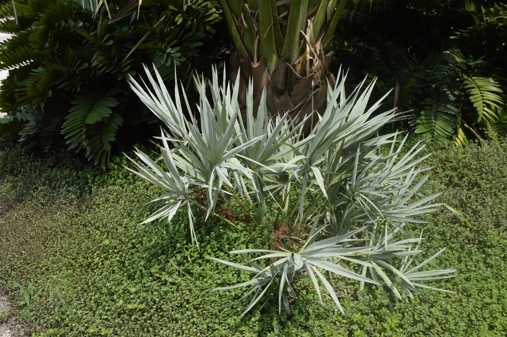
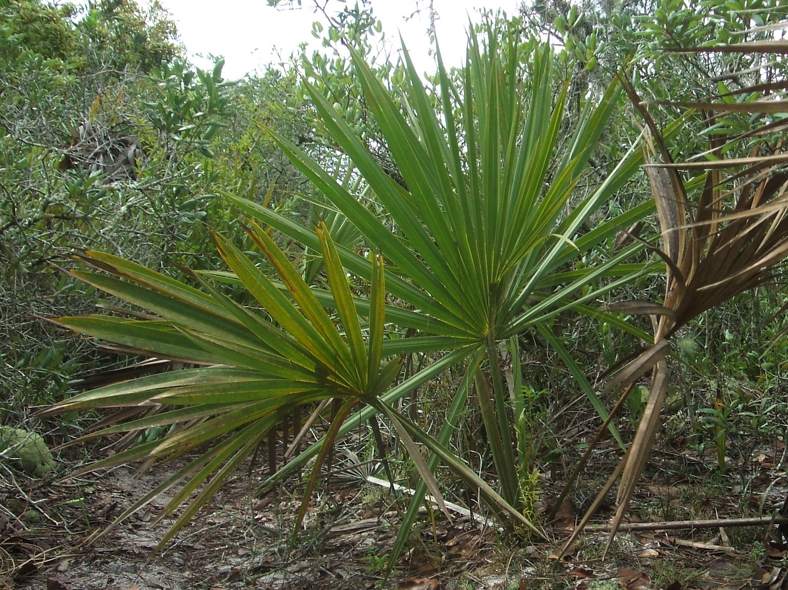

```{r setup, include=FALSE}
knitr::opts_chunk$set(echo = TRUE)

library(tidyverse)
library(here)
library(GGally)
library(broom)
library(kableExtra)
library(janitor)
library(scales)
```

### Overview

This document explores differences between two species of *Serenoa* using the variables height, weight, length, number of green leaves. The first section, "Preliminary Data Exploration", presents 3  visualizations (scatterplot, boxplot, jitterplot) of plant characteristics and how they compare within and between the two species. The second section generates a binomial logistic regression model using plant height, canopy length, canopy width and green leaves as predictor variables to predict differences between these two species. The final section evaluates the success of this model, displaying discrepancies between when the model was correct and incorrect for both species.


{width=70%}

{width=70%}


### Data Explained

This dataset contains plant characteristics for *Serenoa repens* and *Sabal etonia*, at Archbold Biological Station in south-central Florida. Data was collected from 1981 - 2017 in ongoing 5 year intervals.

### Read and Wrangle Data

```{r, echo=TRUE, message=FALSE, warning=FALSE}
#read in csv data
palmetto_data <- read_csv(here("_posts", "post_data", "all_palmetto_data.csv")) %>% 
  select(species, height, length, width, green_lvs) %>%  # select only columns to be used for analysis
  mutate(species_name = case_when(
    species == 1 ~ "Serenoa repens",
    species == 2 ~ "Sabal etonia"
  ))
```

### Preliminary Data Exploration

#### 1. Height vs. Length Scatterplot
```{r, echo=TRUE, message=FALSE, warning=FALSE}
ggplot(data = palmetto_data, aes(x = height, y=length)) +
  geom_point(aes(color=species_name)) +
  labs(
    title = 'Height vs. length for Sabla etonia and Serenoa repens (1981-2017)',
    x = 'Height (cm)',
    y = 'Length (cm)'
  )
```

**Figure 1:** This scatter plot explores displays the relationship between length (cm) and height (cm) for *Sabal etonia* and *Serenoa repens*.

Key Takeaway: Height and length for both plants have a strong linear positively correlation. Across the dataset, *Sabal etonia* appears to be longer and taller than *Serenoa repens*.


#### 2. Boxplots comparing counts of green leaves by species
```{r, echo=TRUE, message=FALSE, warning=FALSE}
ggplot(data = palmetto_data, aes(x = species_name, y=green_lvs, fill=species_name)) +
  geom_boxplot() +
  scale_fill_brewer(palette = "Blues") +
  labs(
    title = 'Green leaf count vs. species for Sabla etonia and Serenoa repens (1981-2017)',
    x = 'Species',
    y = 'Number of Green Leaves (count)'
  )
```

**Figure 2:** These boxplots compare the difference in number of green leaves counted for *Sabal etonia* and *Serenoa repens*.

Key Takeaway: *Serenoa repens* has a higher mean number of green leaves counted than *Sabal etonia*.


#### 3. Boxplots comparing counts of green leaves by species
```{r, echo=TRUE, message=FALSE, warning=FALSE}
ggplot(data = palmetto_data, aes(x = species_name, y = width)) +
  geom_jitter(aes(color=species_name)) +
  labs(
    title = 'Green leaf count vs. species for Sabla etonia and Serenoa repens (1981-2017)',
    x = 'Species',
    y = 'Width (cm)'
  )
```

**Figure 3:** These jitterplots compare the difference in width (cm) for *Sabal etonia* and *Serenoa repens*.

Key Takeaway: *Serenoa repens* and *Sabal etonia* generally have similar widths.

### Binomial logistic regression model

```{r, echo=TRUE, message=FALSE, warning=FALSE}

# convert species value to factor
palmetto_factor <- palmetto_data %>% 
  mutate(species = factor(palmetto_data$species_name)) 

#levels(palmetto_factor$species) #check that species was converted to a factor

#create blr model predicting species
palmetto_blr <- glm(species ~ height + length + width + green_lvs, 
                            data = palmetto_factor, 
                            family = "binomial")

# tidydata
palmetto_tidy <- tidy(palmetto_blr) %>% 
  mutate(p.value = case_when(
            p.value < .05 ~ "< .05")) %>% 
  mutate(term = case_when(
         term == "height" ~ "Height",
         term == "width" ~ "Width", 
         term == "length" ~ "Length",
         term == "green_lvs" ~ "Green leaf count")) 

#create table with model outputs using Kable
kbl(palmetto_tidy, caption = "Palmetto Binomial Regression Coefficient Outputs", col.names = c("Variable", "Coefficient", "Standard Error", "Z-statistic", "P-value")) %>%
  kable_styling(bootstrap_options = "striped",
                full_width = F)
```

### Breakdown of model accuracy

```{r, echo=TRUE, message=FALSE, warning=FALSE}
#make predictions using blr model
blr_fitted <- palmetto_blr %>%
  broom::augment(type.predict = "response")

#create table of correct vs. incorrect values
blr_per_correct <- blr_fitted %>% 
  mutate(predicted = case_when(.fitted >= 0.5 ~ 'Serenoa repens', 
                              .fitted < 0.5  ~ 'Sabal etonia')) %>% 
  mutate(accuracy = case_when(predicted == species ~ 'correct', 
                              predicted != species  ~ 'incorrect')) %>% 
  group_by(species, accuracy) %>% 
  summarize(count = n()) %>% 
  pivot_wider(names_from = accuracy,
              values_from = count) %>% 
  mutate(percent_correct = percent((correct/(correct + incorrect))))

kbl(blr_per_correct, caption = "Palmetto Binomial Regression Model Accuracy", 
    col.names = c("Species", "Number Correct", "Number Incorrect", "Percent Correct")) %>%
    kable_styling(bootstrap_options = "striped", full_width = F)
```

### Citation

Abrahamson, W.G. 2019. Survival, growth and biomass estimates of two dominant palmetto species of south-central Florida from 1981 - 2017, ongoing at 5-year intervals ver 1. Environmental Data Initiative. https://doi.org/10.6073/pasta/f2f96ec76fbbd4b9db431c79a770c4d5 (Accessed 2021-02-07).
