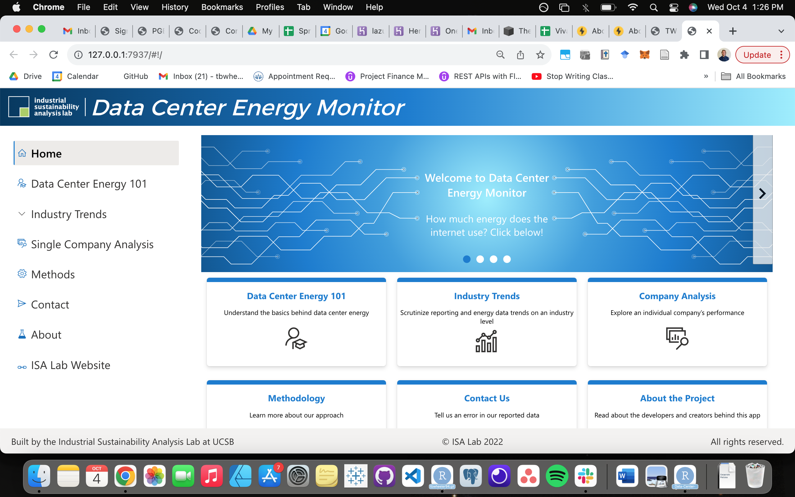

**NOTE:** Site is scheduled for launch this summer, link is not yet live. Contact me for a demo of test server.

### Project overview

In recent years, demand for computing power has emerged as a significant industrial energy consumer, attracting the interest of climate modelers/policymakers, corporate sustainability leaders, and the public as an area of our energy system needing better data to estimate its current and future energy consumption.

Efforts to model the energy use of this sector have traditionally relied on using indirect methods (ex. finding data on the number of servers shipped from country A to country B and assuming those servers would be used X percent of the time at X capacity) due to opaqueness in sustainability report by large computing energy users and the relatively distributed nature of the internet's energy use.

The rise of large technology companies (Amazon, Apple, Google, etc.), who've invested heavily in providing computing services, since the mid-2000s has shifted this dynamic in two key ways:

- A greater percentage of the internet's total energy use is shifting from on-site, small-scale servers managed by in-house IT teams to off-site, large-scale, remotely managed data centers. The largest of these data centers are warehouses filled with thousands of servers that provide computing power to a multitude of users, generally via internet connection. These data centers are operated by a relatively small number of large technology companies and are growing at a rapid pace, accounting for an [estimated 89% of compute instances in 2018](https://datacenters.lbl.gov/sites/default/files/Masanet_et_al_Science_2020.full_.pdf). 

  Notably though, data center energy demand per compute instance has [decreased annually by 20% since 2010](https://datacenters.lbl.gov/sites/default/files/Masanet_et_al_Science_2020.full_.pdf) demonstrating the potential for large-scale data centers to offset some of the total energy demand through efficiency gains. As this relatively small group of companies uses more and more of total computing energy demand, we will become more reliant on their transparency to get closer to finding an aggregate number for total global computing energy demand.

- Increasing public concern about the social and environmental impact of large technology firms have put pressure on these companies to be more transparent about their energy use and emissions. As companies are more transparent in their reporting, the public will be able to put together the larger puzzle of total current and future energy demand.

Ultimately, to find an aggregate "total energy use of the internet" value, a mix of data center operator reported statistics & indirect methods will likely be needed. To unlock the value of this data, companies will need to move toward reporting data center energy consumption and other sustainability data (energy efficiency, emissions, etc.) publicly using a **standardized, easily accessible, and publicly-available methodology**. As of this writing in 2022, publicly available reporting of data center energy use and related sustainability data is largely non-standardized, consisting primarily of a mix of self-reported statistics released in CSR/ESG reports, websites, financial filing, and news articles. For many companies, aggregate energy reporting is non-existent.

### Our purpose

movingbits.org aims to fill the absence of widely available, easy to aggregate and visualize data center energy use and sustainability data. Our application aims to: 

- Be an educational resource for members of the public who are interested in learning more about how data centers work and their energy demand.

- Provide accurate, up to date statistics on individual company and industry-wide energy use and transparency trends.

- Indirectly put pressure on companies who are lagging in energy reporting transparency or falling behind on reaching sustainability goals.

### Data

The dataset visualized by the dashboard is a compilation of energy, sustainability, and reporting transparency data from 50+ of the largest global technology companies.

Data is currently collected and input manually into a central database by the movingbits.org team. Reporting sources for each company can be found on the "Single Company Analysis" tab.

Some examples of places where we collect data from include:

- Annual report (ex. [Twitter FY2020 Annual Report](https://s22.q4cdn.com/826641620/files/doc_financials/2020/ar/FiscalYR2020_Twitter_Annual_Report.pdf))
- Web page (ex. [Microsoft - How Microsoft measures datacenter water and energy use to improve Azure Cloud sustainability](https://azure.microsoft.com/en-us/blog/how-microsoft-measures-datacenter-water-and-energy-use-to-improve-azure-cloud-sustainability/))
- SEC Filing (ex. [Digital Realty 10K](https://ucsb.box.com/s/io6m91zf7g9o0uvci0c5oqrkt3hcj4c0))
- Sustainability Report (ex. [Apple 2021 Environmental Progress Report](https://www.apple.com/environment/pdf/Apple_Environmental_Progress_Report_2021.pdf))

### Application tech stack

Front-end:

- HTML
- CSS
- JavaScript

Back-end:

- R Shiny
- R

