{width=100%}

## Project overview

This analysis was conducted as the final project for [Professor Eric Masanet's](https://bren.ucsb.edu/people/eric-masanet) [Energy Demand Analysis](https://bren.ucsb.edu/courses/esm-287) course taught at the [Bren School of Environmental Science & Management](https://bren.ucsb.edu/). The goal of this project was to assess to what degree energy demand reduction strategies can contribute to decarbonizing commercial buildings by 2050.

To answer this question, my team and I modeled primary energy demand and emissions from 2022 - 2050 under 2 scenarios: 

1. A baseline scenario where no energy demand reduction strategies are implemented.

2. A low energy & emissions (LEES) scenario where efficiency standards, financial incentives for new technologies, and building code updates are implemented.

*both scenarios assume the electric grid mix (percentage of energy coming from zero carbon sources) is significantly less carbon intensive by 2050.

## Model Development Steps

Our model development consisted of 6 steps:

### 1. Determine what energy services and the respective technologies providing these services to include in modeling scope. We chose to model energy change and emissions for:

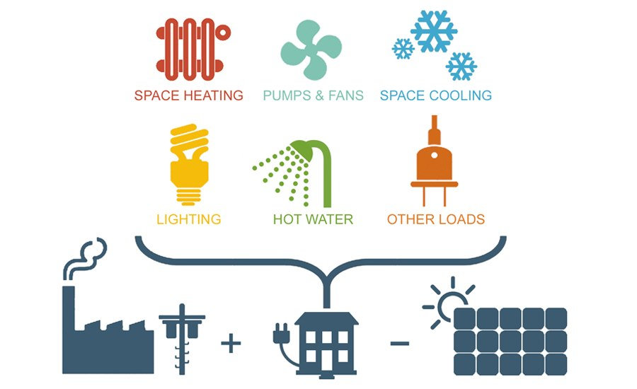{width=100%}

- Space heating (district heating, electric heat pump, natural gas furnace, natural gas boiler)
- Space cooling (electric air conditioner, electric chiller)
- Water heating (natural gas tankless, electric tankless, heat pump)
- Dish washing (dishwasher)
- Lighting (incandescent bulbs, fluorescent bulbs, LED bulbs)
- Personal computing (desktop computer, laptop computer, monitor)
- Refrigeration (refrigerator)

NOTE: the **energy service** is the service being demanded by the energy user from the **technology**. For example, lighting is the energy service demanded from the energy user by a light bulb. Energy technologies are listed above in parenthesis next to their respective energy service.

### 2. Divide analysis for each scenario into separate excel models for easier usability:

(1) [Baseline scenario for space heating and cooling](https://docs.google.com/spreadsheets/d/1k_bQKMp6czVrrDZ7mt0kTldP2237Its-/edit#gid=572723875) (note: geographic region inputs & outputs are contained in separate sheets)

(2) [LEES scenario for space heating and cooling](https://docs.google.com/spreadsheets/d/1OEro91lIcXPMNVTVYMrSW5cbm2WV3uOY/edit#gid=572723875) (note: geographic region inputs & outputs are contained in separate sheets)

(3) [Baseline & LEES scenarios for water heating, appliances, lighting, personal computing, refrigeration (WALPR)](https://docs.google.com/spreadsheets/d/1hntHyaVOR5DUulQ-W67wbbfNKC05cwAG/edit#gid=1065995311) (note: baseline inputs and outputs are on sheet 1 & 2, respectively. LEES inputs and outputs are on sheets 3 & 4, respectively.)

### 3. Calculate future demand for energy services in commercial buildings:

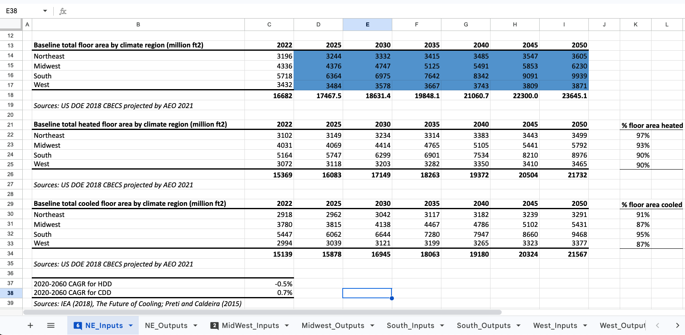{width=100%}

(1) Begin by calculating projected total commercial building floor area (in ft2) for Northeast, Midwest, South, and West [EIA census divisions](https://www.eia.gov/energyexplained/units-and-calculators/degree-days.php) using projections using [EIA CBECS](https://www.eia.gov/consumption/) data. Copy these regional floor area projections across each model.

(2) Within the space heating and cooling models, account for variability in demand for heating and cooling across each region by calculating projected heating degree days (HDD) and cooling degree days (CDD). These are measure of the demand for space heating and cooling by buildings based on the ambient outdoor temperature.*

(3) Within the WALPR model, make the following assumptions:

- energy demand for each ft2 of future commercial buildings will remain constant
- average floor area per worker will not change
- energy demand does not vary by geography (no need to account for HDD and CDD) and is equally distributed by region across the U.S.
- the number of commercial building workers will grow in proportion to the ft2 of the building

In short, the density of future workers in commercial buildings will stay the same, energy intensity per worker in a commercial buildings will stay the same, and each worker will use the same amount of energy on average all around the United States.

*The number of heating/cooling degree days for each region are calculated by (1) calculating the mean temperature of a day (daily high + daily low/2) and subtracting by 65F (2) repeating this calculation for all days in 1 year and then summing. [Click here](https://www.weather.gov/key/climate_heat_cool#:~:text=Degree%20days%20are%20based%20on,two) for a more detailed explanation. We assume, due to climate change leading to generally warmer temperatures year round, the number of heating degree days will have a CAGR of -0.5% and cooling degree days will have a CAGR of 0.7% across each region.

### 4. Model energy demand and emissions for the baseline models:

With no demand-side technology or behavioral changes, the baseline scenario makes the following assumptions:

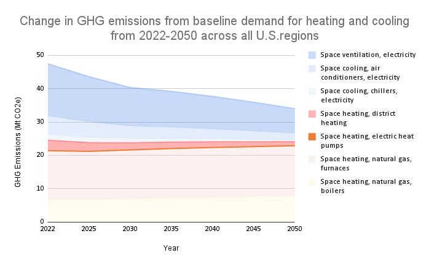{width=100%}

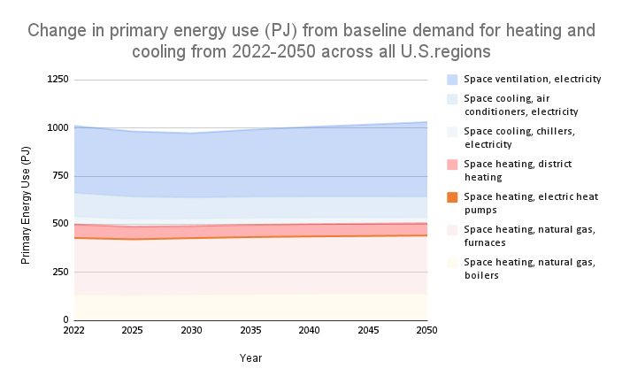{width=100%}

Baseline space heating and cooling model:

- Energy demand for all technologies will increase due to the increase in total amount of commercial building floor area (ft2) and thus more floor area needing heating and cooling
- Heat pumps will experience efficiency gains through time, while other technology's energy efficiency will not change due to their relative maturity
- Adoption of energy technologies for air heating and cooling will remain constant to 2050 at 2022 percentages (77% demand met by natural gas, 4% demand met by electricity, 19% met by district heating)
- No reduction in individual user energy usage through behavior change

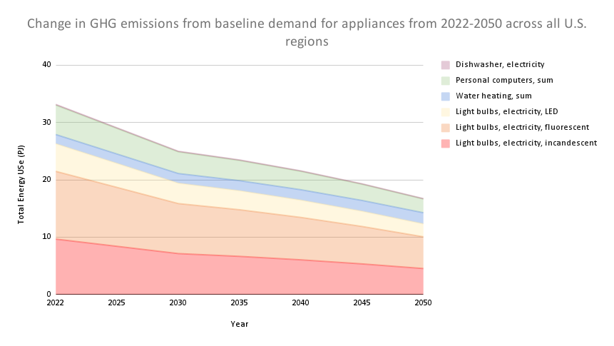{width=100%}

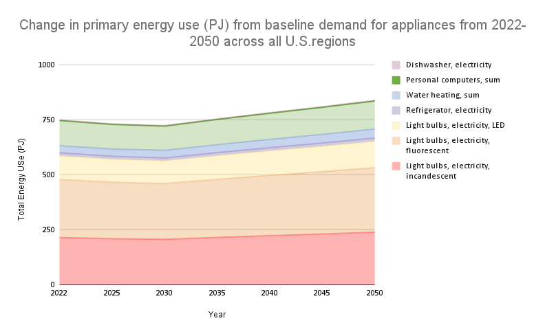{width=100%}

Baseline WALPR model:

- Energy demand for all technologies will increase due to an increased number of workers in commercial buildings
- Adoption of energy technologies for WALPR will remain constant to 2050 at 2022 percentages (e.g. for lighting, 12% of lumens met by incandescent bulbs, 58% of lumens met by fluorescent bulbs, 30% of lumens met by LEDs)
- No efficiency changes for water heaters, appliances, light bulbs, personal computers, or refrigerators
- No reduction in individual user energy usage through behavior change

### 5. Choose what energy demand reduction strategies to model in the LEES scenario:

We chose the following strategies for reducing energy demand:

- 💡📈 **Increase share of LED lighting** via a government subsidy (direct payment) on LED purchases.

- 💡📉 **Phase out low efficiency lighting** (incandescent lighting) by instituting a ban on light bulbs that producing less than 45 lumens per watt by 2030.

- ⚡️🌬📈 **Increase share of heat pumps for air heating/cooling** with a subsidy (tax credit) for new heat pump purchases.

- ⚡♨️📈 **Increase share of heat pumps for water heating/cooling** with a subsidy (tax credit) for new heat pump purchases.

- 💻📈 **Increase adoption of Energy Star appliances (computer, dishwasher, refrigerator)** by mandating minimum efficiency standards for appliances.

- 🌱👷📈**Increase share of “green construction” (daylighting, green walls, white paint on roofs)** used in newly constructed buildings with a financial incentive for green construction.

- 🌱👷📈**Increase insulation used in new building construction and retrofits** by updating building code requirements.

- ⚙️🌬**Optimize air heating and cooling with NEST thermostat** with a subsidy (direct payment) for NEST thermostat installations.

### 6. Model energy demand and emissions for the LEES models:

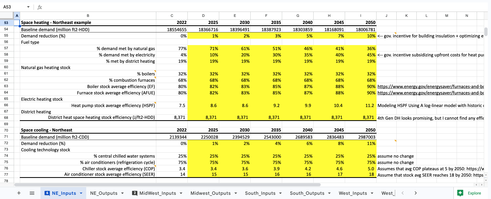{width=100%}
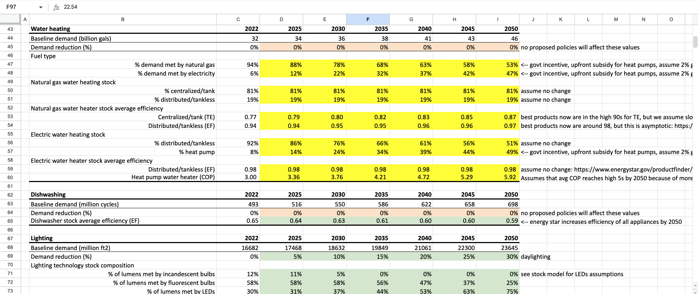{width=100%}
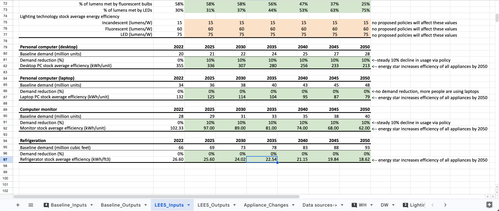{width=100%}

Calculate the projected energy demand and emissions under the LEES scenario by projecting the energy change due to:

- **Fuel Switching** —  reducing demand for energy or emissions intensity by switching from a high energy/emissions intensity technology to low energy energy/emissions intensity technology (i.e. replacing natural gas furnace with heat pump)
- **Demand Avoidance** — reducing demand for energy in the first place (i.e. demand reduction from better building design or NEST thermostat installation)
- **Energy Efficiency** — energy demand reduction induced via modeled technologies become more energy efficient through time (i.e. a personal computer using less energy per unit)

## Graphing and interpreting results

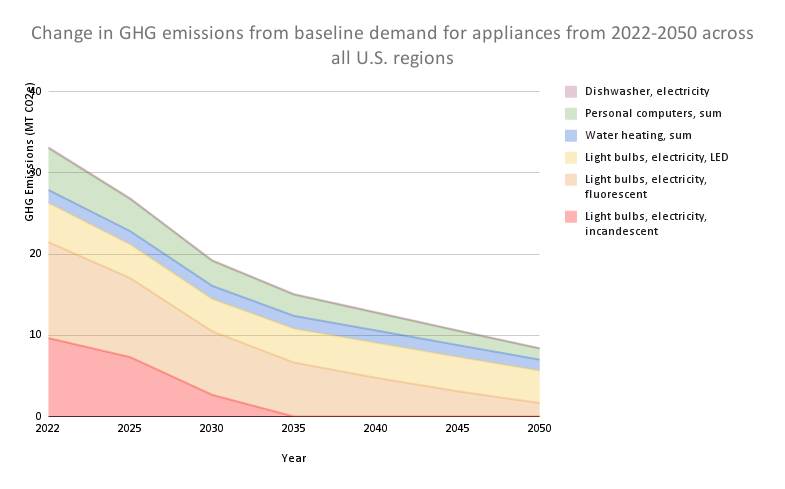{width=100%}

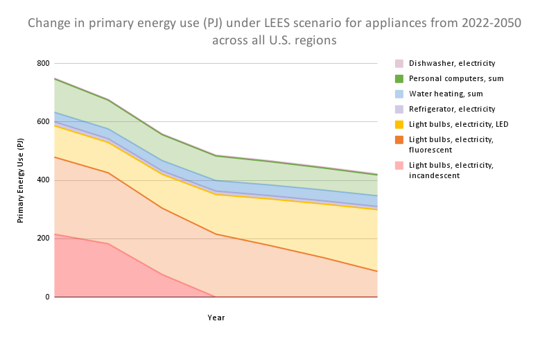{width=100%}

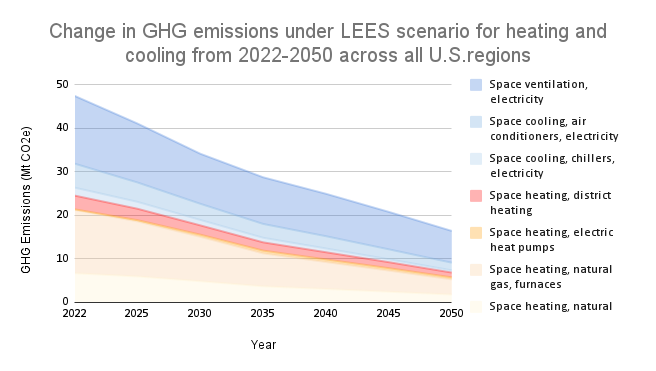{width=100%}

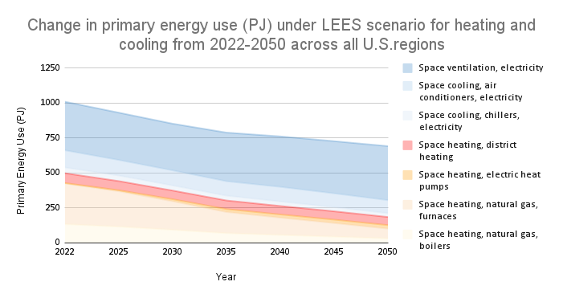{width=100%}

### Results

- For the heating and cooling model, the proposed LEES scenario policies pushed primary energy demand down to 687.5 PJ by 2050 (down from 1,011 PJ in 2022). This constitutes a **33.3% reduction** relative to our baseline scenario. CO2 emissions from heating and cooling decreased from 47.5 MT CO2e in 2022 to 16.3 MT CO2e by 2050. This constitutes a **52% reduction** relative to our baseline scenario.

- For the WALPR model, our proposed policies pushed primary energy demand down to 422 PJ by 2050 from 751 PJ in 2022, a **50% reduction** relative to our baseline scenario. CO2 emissions from appliances decreased from 33.16 MT CO2e in 2022 to 8.42 MT CO2e by 2050, a **50% reduction** relative to our baseline scenario.

### Key takeaways & insights

The most important strategy we found was **electrifying heating and cooling, especially through the use of heat pumps**. Converting these systems to electricity yields better GHG reductions over time as the grid becomes less carbon intensive. Furthermore, since heat pumps are much more efficient than traditional heating and cooling systems, companies could face significantly less spending on energy given electricity prices stay relatively stable or decrease through 2050. We think that providing a financial incentive for heat pumps adoption, like an upfront cost subsidy, would alleviate high switching costs and other current barriers to adoption. 

Similarly, switching to LEDs on the appliance side and phasing out the sale of incandescent bulbs by 2030 accounts for a reduction of almost 10 MT CO2e emissions and 200 PJ of primary energy use. We think this is a reasonable goal given the short turnover time of lightbulbs, technological improvements in the quality of LEDs, LED lifespan, and overall energy efficiency gains. Primary energy use of LEDs increases with more use of LEDs, but overall GHG emissions stay near constant, even with the substitution of fluorescent and incandescent bulbs. This can be attributed to a more decarbonized grid with more renewable energy penetration. 

Daylighting, green walls, and white painted roofs are all helpful policies, but they become less important as the electricity grid becomes more decarbonized and appliances and heating and cooling systems become more electrified. Thus, the first goal should be to electrify heating and cooling systems, and the second goal should be to transition to LEDs and phase out incandescent bulbs as quickly as possible.

### Excel Analysis Models

[Baseline Heating & Cooling](https://docs.google.com/spreadsheets/d/1k_bQKMp6czVrrDZ7mt0kTldP2237Its-/edit#gid=572723875) \

[LEES Heating & Cooling](https://docs.google.com/spreadsheets/d/1OEro91lIcXPMNVTVYMrSW5cbm2WV3uOY/edit#gid=572723875) \

[Appliances](https://docs.google.com/spreadsheets/d/1hntHyaVOR5DUulQ-W67wbbfNKC05cwAG/edit#gid=1065995311) (includes both baseline & LEES) \

## Other project materials

### Final report & presentation

A detailed description of our analysis result can be read in our [final report](https://drive.google.com/file/d/1P5F7BhFH8PXVnmV9oKE1bBj8lgG9WsRC/view).

A summary of results can be viewed in our [final presentation](https://docs.google.com/presentation/d/1uQjMNfmHyYOhQDC0p-cNSrVDS4Q5eu_I/edit?usp=sharing&ouid=117367242494310945181&rtpof=true&sd=true).

### Data

1. EPA Office of Air and Radiation, Climate Protection Partnerships Division. Light Bulb Revolution: EPA Predicts Widespread
Consumer Adoption of LED Lighting by 2020 if Utility Programs Persist. U.S. EPA, 2017.
https://www.energystar.gov/sites/default/files/asset/document/LBR_2017-LED-Takeover.pdf

2. IEA (2018), The Future of Cooling; Preti and Caldeira (2015)

3. Energy STAR. 2022. “ENERGY STAR Certified Commercial Water Heaters.” Energy STAR. 2022.
https://www.energystar.gov/productfinder/product/certified-commercial-water-heaters/results.

4. Energy STAR. n.d. “About Energy Efficiency.” Energy STAR. Accessed June 6, 2022.
https://www.energystar.gov/about/about_energy_efficiency.

5. OAR US EPA, “Using Green Roofs to Reduce Heat Islands,” Overviews and Factsheets, last modified June 17, 2014, accessed
June 1, 2022, https://www.epa.gov/heatislands/using-green-roofs-reduce-heat-islands.

6. OAR US EPA, “Using Cool Roofs to Reduce Heat Islands,” Overviews and Factsheets, last modified June 17, 2014, accessed
June 1, 2022, https://www.epa.gov/heatislands/using-cool-roofs-reduce-heat-islands.

7. Biswas, Kaushik, Som S. Shrestha, Mahabir S. Bhandari, and Andre O. Desjarlais. 2016. “Insulation Materials for Commercial
Buildings in North America: An Assessment of Lifetime Energy and Environmental Impacts.” Energy and Buildings 112 (January):
256–69. https://doi.org/10.1016/j.enbuild.2015.12.013.

8. U.S. Department of Energy. 2022. Enforcement Policy Statement-General Service Lamps.

9. IEA (2021), Lighting, IEA, Paris. https://www.iea.org/reports/lighting

10. EPA Office of Air and Radiation, Climate Protection Partnerships Division. Light Bulb Revolution: EPA Predicts Widespread
Consumer Adoption of LED Lighting by 2020 if Utility Programs Persist. U.S. EPA, 2017.
https://www.energystar.gov/sites/default/files/asset/document/LBR_2017-LED-Takeover.pdf

11. Dunsky Energy Consulting. 2021. “Heating Electrification: Policies to Drive Ground-Source Heat Pump Adoption.” Heating,
Refrigeration and Air Conditioning Institute of Canada (HRAI).

12. Office of Energy Efficiency and Renewable Energy. n.d. “Energy Efficiency Policies and Programs.” Energy.Gov. Accessed June
6, 2022. https://www.energy.gov/eere/slsc/energy-efficiency-policies-and-programs.

13. EPA Office of Air and Radiation, Climate Protection Partnerships Division. Light Bulb Revolution: EPA Predicts Widespread
Consumer Adoption of LED Lighting by 2020 if Utility Programs Persist. U.S. EPA, 2017.
https://www.energystar.gov/sites/default/files/asset/document/LBR_2017-LED-Takeover.pdf

14. EPA Office of Air and Radiation, Climate Protection Partnerships Division. Light Bulb Revolution: EPA Predicts Widespread
Consumer Adoption of LED Lighting by 2020 if Utility Programs Persist. U.S. EPA, 2017.
https://www.energystar.gov/sites/default/files/asset/document/LBR_2017-LED-Takeover.pdf

15. Goodman Air Conditioning and Heating. n.d. “Generations of Heat Pumps.” Accessed June 6, 2022.
https://www.goodmanmfg.com/resources/hvac-learning-center/?param1=before-you-buy&param2=what-generation-is-your-h
eat-pump.

16. Thomas A Deetjen et al 2021 Environ. Res. Lett. 16 084024. https://iopscience.iop.org/article/10.1088/1748-9326/ac10dc

17. Chua, K. J., S. K. Chou, and W. M. Yang. 2010. “Advances in Heat Pump Systems: A Review.” Applied Energy 87 (12): 3611–24.
https://doi.org/10.1016/j.apenergy.2010.06.014.

18. IEA (2019), District heating needs flexibility to navigate the energy transition, IEA, Paris
https://www.iea.org/commentaries/district-heating-needs-flexibility-to-navigate-the-energy-transition

### Overview of Energy Demand Analysis course from syllabus

"This course will introduce students to basic concepts and quantitative approaches for understanding and analyzing societal demand for energy. In the first half of the course, students will learn core energy analysis skills and principles including working with official energy statistics, quantification of energy services, projecting demand drivers, modeling technology stock turnover, embodied energy accounting, and constructing marginal abatement/cost curves. 

In the second half of the course, students will apply this knowledge to construct a simplified (i.e., reduced scope) energy demand model for the United States, focusing on the buildings, transport, industrial, and food sectors. Students will also learn about major technological, behavioral, and policy strategies for transforming energy demand as a means of achieving climate objectives, and will apply their models in group projects to develop demand-sides scenarios and plans for deep decarbonization of the U.S. energy system."
