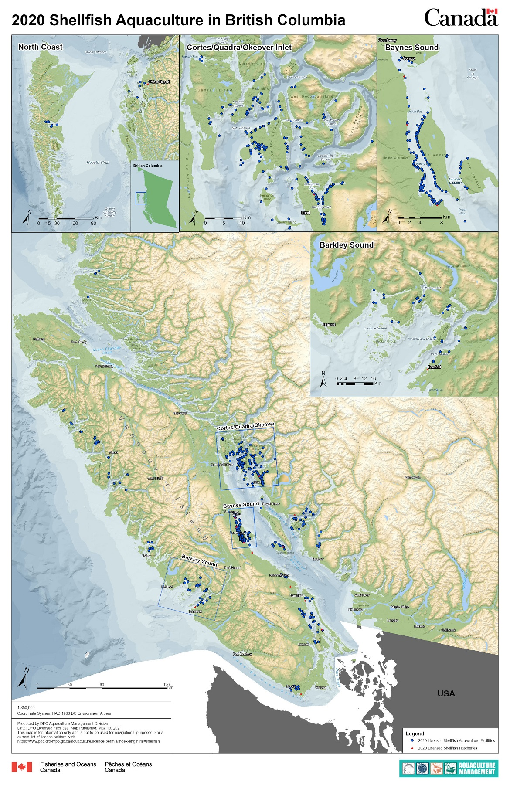
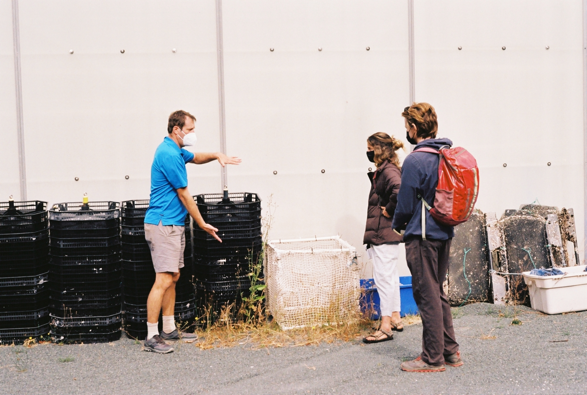

### Group project team members

Thomas Wheeler (project manager) \
[Halley McVeigh](https://www.linkedin.com/in/halley-mcveigh-85b201197/) \
[Mariano Viz](https://www.linkedin.com/in/marianoviz/) \
[Caitie Reza](https://www.linkedin.com/in/caitie-reza-50b8a7115/) \
[Emiliano Espinoza](https://www.linkedin.com/in/emiliano-e-espinoza/) \

### Faculty advisor

[Dr. Christopher Costello](https://bren.ucsb.edu/people/christopher-costello)

### Client

[Scoot Science](https://www.scootscience.com/)

### Key documents and links

[Final report](https://drive.google.com/file/d/1rX0iia9U1DlmxjSa5MyBEejMjK2ZdH9P/view) \
[Executive summary](https://drive.google.com/file/d/1kOiZjRxo2O9XaCWlGE0AmN6VlNDYeiUJ/view?usp=sharing) \
[Final presentation](https://vimeo.com/710598339?embedded=false&source=vimeo_logo&owner=115869184) \
[Faculty review presentation](https://drive.google.com/file/d/1MxMPqVTcVUHUvITJi1TDw-y4nMlyEt3L/view) \

### What are group projects?

Master’s Group Projects bring together teams of 4-5 students to solve environmental problems for a client. As project manager of my group, I served as primary client contact, facilitated team meetings, collaborated on project tasks, and directed project development from initial proposal to final deliverables. Learn more about group projects at the Bren school [here](https://bren.ucsb.edu/masters-programs/master-environmental-science-and-management/masters-group-projects).

{width=100%}

### Summary of project

Shellfish aquaculture will play a critical role in meeting the growing global demand for protein with low ecosystem impact and carbon intensity. Regions that have experienced inhibited growth in their shellfish aquaculture industries, such as British Columbia, must invest in technical and community-driven solutions to overcome industry barriers. A key barrier to B.C.’s growth is environmental uncertainty, which impedes optimal farm management and increases the investment risk of shellfish farms.

To reduce environmental uncertainty, shellfish operations around the world are investing in environmental monitoring and forecasting technologies to provide environmental information for farmers. These investments may signal that shellfish farmers value environmental information, but no efforts have been made to assess this value. We developed a model to quantify the value of environmental information for shellfish farmers and their decision-making.

To develop a holistic understanding of industry obstacles, we also explored the impact of non-environmental barriers on B.C. shellfish farmers. We conducted this evaluation with a literature review and interviews with shellfish farmers, researchers, First Nations members, and industry affiliates. From this research we assessed experiences within three categories of non-environmental barriers and used feature stories to provide grounded examples of farmer experiences.

### Findings from the Value of Environmental Information Model

Our value of information model showed that perfect knowledge of future average temperature, chlorophyll a. concentration, current speed, and particulate organic matter concentration has value for shellfish aquaculture farmers seeking to optimize their stocking density to maximize expected profit. Further, we found the value of this environmental information is not uniform across these four variables; current speed exhibited the highest value of information and temperature the lowest. 

The change of the value of information across the four variables was dependent on both the variability of optimal stocking densities and the variability in expected profits across the five model environmental scenarios. Ultimately, this model provided insight into what makes information valuable.

{width=100%}

### Findings from the Assessment of Non-Environmental Barriers

We categorized non-environmental barriers into three buckets: regulatory & political, social & cultural, and logistic & economic. Though distinctly divided, many of these barriers are acutely interconnected and carry more or less weight depending on the size of the farm and community in which it’s located. Transportation costs, for example, disproportionately affect remote farms with limited access to processing infrastructure. 

Many social barriers stem from conflicting community priorities, disparities in First Nations involvement in the B.C. industry, and an overall lack of cross-community collaboration. We found that potential solutions to overcoming non-environmental barriers include a shift toward cooperative style business models, investing in First Nation capacity to support new ventures, and forging partnerships to enable community support.

{width=50%}

### Research Impact

Improving decision-making under environmental uncertainty and addressing non-environmental industry barriers are crucial steps to foster growth and expand First Nation leadership in the B.C. shellfish industry. Our framework is a tool that environmental forecasting service providers can use to assess what information is most valuable when seeking to reduce environmental uncertainty. Most importantly, this tool provides insight into what factors make information valuable, enabling a more rapid assessment of what environmental information has the greatest potential to impact farmer decision-making. 

Insights from our assessment of non-environmental barriers contribute to a deeper understanding of the B.C. industry landscape and provide a framework for understanding the challenges and experiences of shellfish farmers. To overcome all industry barriers, a combination of new technologies, investments, partnerships, leadership, and increased understanding will be needed to advance the B.C. shellfish industry’s potential.
