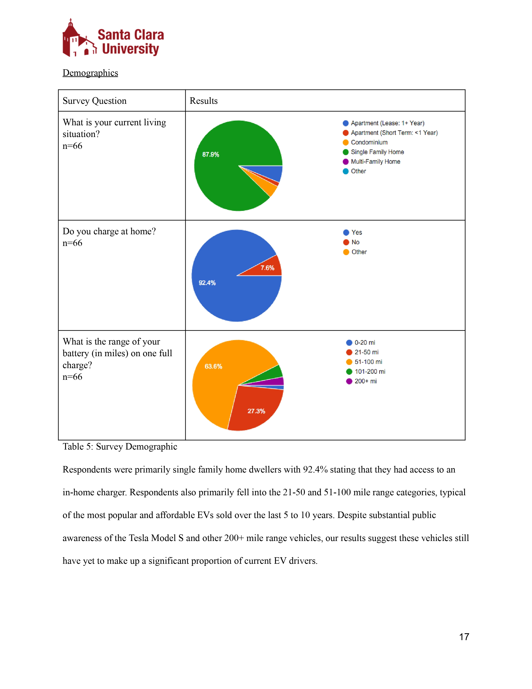
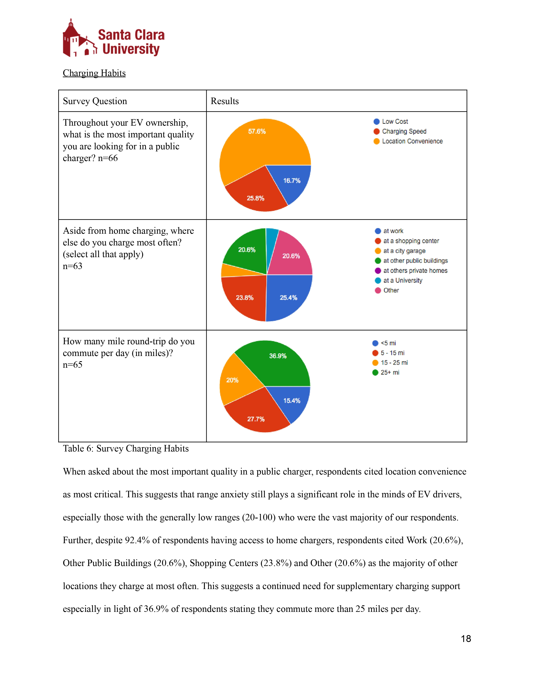
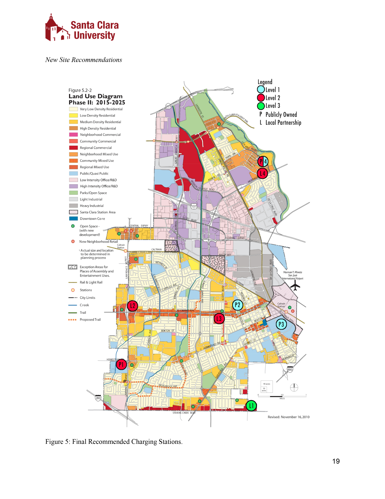

### Consulting project team members

Thomas Wheeler (project manager) \
[Keely O'Donnell](https://www.linkedin.com/in/keelyodonnell/) \
[Mario Tapia](https://www.linkedin.com/in/vmtap/) \
[Brennan Balson](https://www.linkedin.com/in/brennan-balson-030278a6/) \

### Faculty advisor

[Stephanie Hughes](https://www.scu.edu/cas/ess/faculty-and-staff/stephanie-hughes/)

### Client

[Silicon Valley Power](https://www.siliconvalleypower.com/)

### Key documents and links

[Final report](https://docs.google.com/document/d/1Yhay_MlbjwYilLbVi4anF1zHTcWGXdRuuodwYNEr0fI/edit?usp=sharing) \
[Final poster](https://drive.google.com/file/d/0B0Ppu0ggvYKbbFJpN3l4RWtFZTQ/view?resourcekey=0-bF0_a1GAKrrM1KO6OFhM6w) \

### What are capstone projects?

Santa Clara University Environmental Science & Studies students form cross-disciplinary consulting teams and work to address a wide range of environmental issues, with the goal of providing research of value to a community partner or agency. Learn more about capstone projects [here](https://www.scu.edu/cas/ess/academic-programs/).

### Abstract

The current scarcity of electric vehicle (EV) charging stations throughout Silicon Valley continues to constrain commuters and locals seeking affordable, reliable and convenient charging opportunities. In partnership with Silicon Valley Power (SVP), the City of Santa Clara’s (CoSC) publicly owned electric utility and recent recipient of funding to install 8 new chargers, we investigated key considerations to guide strategic installation of new publicly owned charging stations to maximize public benefit. Our methods focused primarily on collecting data from EV owners to understand the relationship between EV owner demographics and their patterns of EV use. Data were collected via internet surveys and structured interviews. Background and guidance for framing our survey questions were acquired via a literature review and are discussed in the introduction and literature review sections of this paper. 

We found that public chargers are needed to meet a multitude of demand profiles including commuting, leisure activities and errands, and multi-family residences which typically are unable to install chargers in their homes. SVP will need to consider implementing a mix of Level One, Two, and Three chargers to meet this demand and will need to advocate for policy reform to support installation in multi-family residences. Using the findings from our investigation, we provide recommendations for specific placement of the 8 new charging stations to be installed by SVP throughout the City of Santa Clara (CoSC).

### Survey results and recommended EV charger locations

{width=100%}

{width=100%}

{width=100%}

