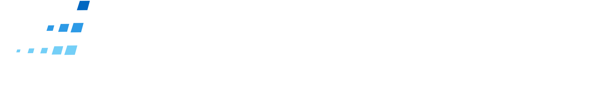
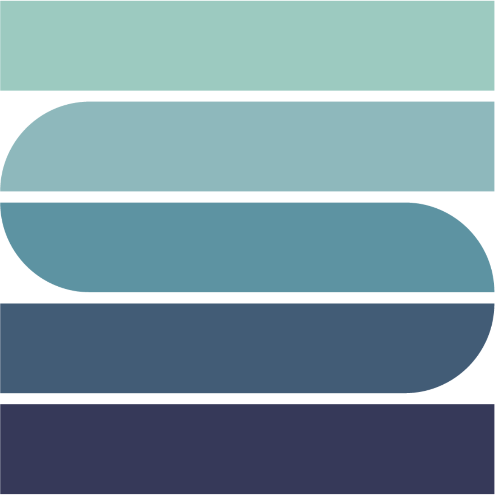
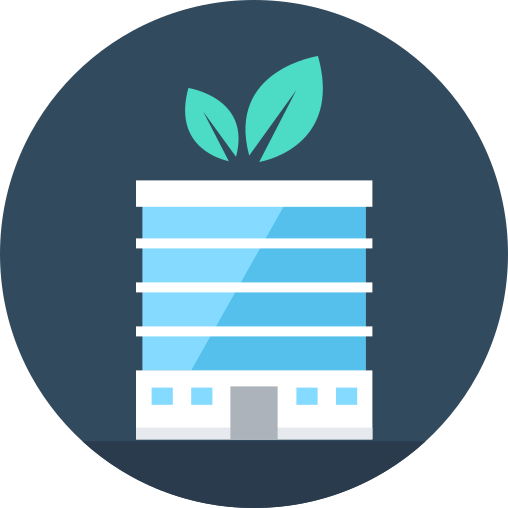

```{r setup, include=FALSE}
knitr::opts_chunk$set(echo = TRUE)
library(knitr)
```

<h4>Bio</h4>

Tom Wheeler is a web developer and energy data analyst with experience building dashboards and data visualizations in the energy, aquaculture, and agriculture industries. Currently developing a dashboard to calculate the future economic value of solar projects in California, Tom is excited about the energy transition and is looking for developer/analyst positions in the energy industry. In his most recent role as a Software Developer for the Industrial Sustainability Analysis Lab, Tom developed a dashboard to help climate policy-makers and energy modelers visualize trends in data center energy use by top technology companies. 

<h4>Web Apps</h4>

<div class="p-2">
<div id="icon-list">
<ul class="list-inline" style="margin-bottom: .4em;">
<li class="list-inline-item">
<span data-toggle="tooltip" title="Dashboard not optimized for small screens. View on large screen (>900px) to enable button." class="hide-tooltip">
<a class="disable-button" href="http://energyexplorer.io/" target="_blank">
<button type="button" class="btn btn-dark mb-2" style="display: inline-flex; align-items: center;">
</img>
energyexplorer.io
</button>
</a>
</span>
<a class="large-screen-button" style="display:none;" href="http://energyexplorer.io/" target="_blank">
<button type="button" class="btn btn-dark mb-2" style="display: inline-flex; align-items: center;">
</img>
energyexplorer.io
</button>
</a>
</li>
<li class="list-inline-item">
<span data-toggle="tooltip" title="Dashboard not optimized for small screens. View on large screen (>900px) to enable button." class="hide-tooltip">
<a class="disable-button" href="https://data-center-energy-use-dashboard.shinyapps.io/data-center-energy-use-dashboard/_w_89636e68/" target="_blank">
<button type="button" class="btn btn-dark mb-2" style="display: inline-flex; align-items: center;">
</img>
</button>
</a>
</span>
<a class="large-screen-button" style="display:none;" href="https://data-center-energy-use-dashboard.shinyapps.io/data-center-energy-use-dashboard/_w_89636e68/" target="_blank">
<button type="button" class="btn btn-dark mb-2" style="display: inline-flex; align-items: center;">
</img>
</button>
</a>
</li>
</ul>
</div>
</div>

<h4>Data Analysis & Other Projects</h4>

<div class="p-2">
<div id="icon-list">
<ul class="list-inline" style="margin-bottom: .4em;">
<li class="list-inline-item">
<div class="dropdown">
<button style="display: inline-flex; align-items: center;" class="btn btn-dark mb-2 dropdown-toggle" type="button" id="dropdownMenuButton" data-toggle="dropdown" aria-haspopup="true" aria-expanded="false">
</img>
Masters Group Project
</button>
<div class="dropdown-menu" aria-labelledby="dropdownMenuLink">
<a class="dropdown-item" href="https://drive.google.com/file/d/1kOiZjRxo2O9XaCWlGE0AmN6VlNDYeiUJ/view?usp=share_link">Executive Summary</a>
<a class="dropdown-item" href="https://drive.google.com/file/d/1FYaE1codVbUPdLRlSjf28ttaZBUjcIEl/view?usp=sharing">Final Report</a>
<a style="margin-bottom: -15px;" class="dropdown-item" href="https://github.com/marianoviz/GP_production_model">Github Repo</a>
</div>
</div>
</li>
<li class="list-inline-item">
<div class="dropdown">
<button style="display: inline-flex; align-items: center;" class="btn btn-dark mb-2 dropdown-toggle" type="button" id="dropdownMenuButton" data-toggle="dropdown" aria-haspopup="true" aria-expanded="false">
</img>
Energy Demand Modeling
</button>
<div class="dropdown-menu" aria-labelledby="dropdownMenuLink">
<a class="dropdown-item" href="https://drive.google.com/file/d/1P5F7BhFH8PXVnmV9oKE1bBj8lgG9WsRC/view?usp=share_link">Final report</a>
<a style="margin-bottom: -15px;" class="dropdown-item" href="https://drive.google.com/drive/folders/1rvqtygHnYaNnRsKbAA4dueROwxt3unek?usp=sharing">Data analysis spreadsheets</a>
</div>
</div>
</li>
<li class="list-inline-item">
<a href="blog.html" target="_blank">
<button type="button" class="btn btn-dark mb-2">
Other Projects & Experience
</button>
</a>
</li>
</ul>
</div>
</div>

<h4>Tools I've Worked With</h4>

**Languages & web development frameworks:** R, R Shiny, Python, Django, JavaScript <br>
**Modeling & analysis:** Geospatial analysis, Seasonal decomposition, Value of information analysis, Energy demand analysis <br>
**Currently (re)learning:** PostgreSQL/pgAdmin

<h4>Education</h4>

**University of California, Santa Barbara** | [Bren School](https://bren.ucsb.edu/masters-programs/master-environmental-science-and-management) | Santa Barbara, CA <br>
Masters of Environmental Science & Management | September 2020 - June 2022

**University of California, San Diego** | [Data Science & Visualization Bootcamp](https://bootcamp.extension.ucsd.edu/data/) | San Diego, CA <br>
Certificate of Completion | January 2020 - June 2020

**Santa Clara University** | Santa Clara, CA <br>
Bachelors of Environmental Science | September 2012 - June 2016

<br>

<style>

  @media screen and (min-width: 990px) {
      body {
        overflow-y: hidden;
        overflow-x: hidden;
      }
  }
  
  @media screen and (min-width: 900px) {
      .hide-tooltip {
        pointer-events: none;
        display: none;
      }
      .large-screen-button {
        display: block !important;
      }
    }
    
  @media screen and (max-width: 900px) {
      .disable-button {
        pointer-events: none;
      }
    }
    
</style>

<script>
  $(function () {
    $('[data-toggle="tooltip"]').tooltip()
    $('.dropdown-toggle').dropdown()
  })
</script>
